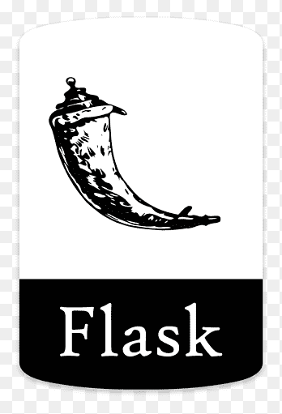

<!-- GIF SECTION -->
<!-- 
If you want to know how I made this gif

I created a simple video using Canva and saved it as a gif.
that is all.
-->

<!-- Social icons section -->

<!-- <h1 align="center"> Social Media: </h1>
  

  
  

</h1> -->

<!-- Description about me -->
<h1 align="center"> 🤔 About me 👨‍💻 </h1>

Hello 👋, I am a computer engineering student.  
Currently, I am focused on developing my skills in areas such as Security Protocols, Network Security, and Fundamentals of Cybersecurity. I aspire to work in these fields in the future, aiming to contribute to advancements and innovations that enhance digital security and protect data integrity.  
Contact me for new projects 📨, I am open to collaborate with you
   

<!-- languajes and skills section -->

<h1 align="center"> Languages and Tools </h1>

  <code></code>
  <code></code>
  <code></code>
  <code></code>
  <code></code>
  <code></code>
  <code></code>
  <code></code>
  <code></code>
  <code></code>
  <code></code>
  

 

<!-- GitHub stats section -->

## 📊 Github stats

<!-- Bassed on: https://github.com/anuraghazra/github-readme-stats -->

   
  
  
   
  <b>Note:</b> Top languages is only a metric of the languages my public code consists of and doesn't reflect experience or skill level.

<!-- Projects section -->

<!-- Visitors section -->

<!-- last refresh of readme section -->

Last refresh: <b>Wednesday, June 27, 2:24 AM GMT+3</b>

<!---
BBilgeKaplan/BBilgeKaplan is a ✨ special ✨ repository because its `README.md` (this file) appears on your GitHub profile.
--->
